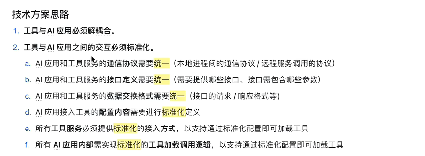

### Function Calling
### 1.要解决的问题
市面上大模型没有工具调用能力，无法感知和改变环境。

用户提问 -> AI应用程序正则匹配 -> 第三方API -> AI应用程序发送给大模型 -> 大模型返回结果

需要后端调用大模型的接口，接口实现底层逻辑。由后端做逻辑复杂，容易出现漏判，输入和字符串强相关，容易出现错误。

### 2. Function Calling
广义：让大模型告诉后端需要做什么，由后端调用返回结果。能够调用外部工具的一种技术实现。
流程：大模型提供商在模型内部与API层面做了支持的一种能力。向大模型传递拥有所有方法的列表和详细说明，告诉它每一个方法是干什么的，详细说明参数含义，把列表和东西一起传给大模型一起，判断是否需要调用，返回标准化回答。
在模型层面：模型提供商需对大模型进行特别优化，使其具备上下文正确选择合适函数，生成有效参数的能力（SFT，RL）。
在API层面：模型提供商需额外开放对Function Calling的支持（比如GPT API中提供了一个functions参数）。
- 基于提示词传递
用户提问 -> AI应用程序 -> 带上system prompt传递给大模型 -> 传回调用指令 （通过反射，本地方法实现）
问题：1. 模型能力本身 （可能生成自然语言回复） -> 提升模型能力 2. 出现幻觉 3. 对开发者要求高 -> 交给提供商系统内部写死 4.每次都传system prompt，需要约束，成本高 => 狭义function calling
- API传递

### MCP: 本地式接入，远程服务式接入， 解决工具接入和复用问题
  - 在任意AI应用中，通过一条标准化配置拉取任意工具的包到本地，并在本地起一个进程，将工具作为一个服务运行起来
  - 自动获取工具的描述信息，自动完成工具的调用过程

工具client和工具server一对一